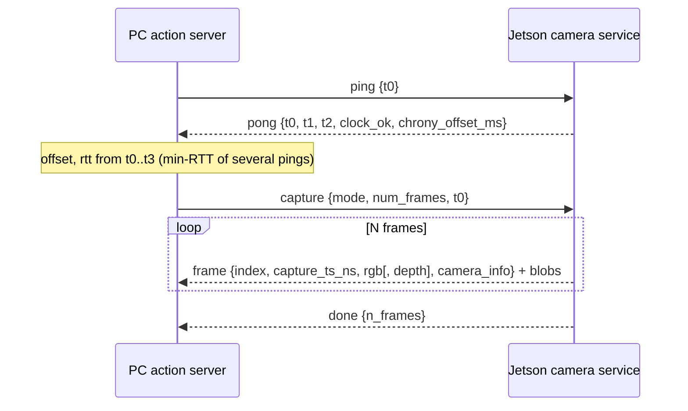

# Camera link protocol (PC ⇄ Jetson), version 1

Contract between the PC-side `capture_camera_frames_action_server` and the camera
service that runs next to the camera (the Jetson with the ZED2i). The Jetson
implements the **server** side of this document; the PC node is the **client**.
`scripts/mock_camera_service.py` is a reference implementation of the server.



## 1. Transport and framing

- One TCP connection, kept open between goals. The PC reconnects on its own if it
  drops. The Jetson must accept a new connection at any time. How the PC reaches
  the port (SSH tunnel or direct route) is deployment config, not part of the protocol.
- Every message, in both directions:

  | bytes | content |
  |---|---|
  | 4 | `uint32` **big-endian**: length `H` of the JSON header |
  | `H` | UTF-8 JSON object (the header) |
  | `sum(blob_sizes)` | binary blobs, concatenated in the order of `blob_sizes` |

- Every header has `"version": 1`, a `"type"` string and `"blob_sizes"` (list of
  byte counts, `[]` if the message has no blobs). A receiver that sees another
  `version` replies with an `error` message.
- All timestamps are `int64` **nanoseconds since the Unix epoch** in the sender's own
  clock (JSON integers, no floats).

## 2. Messages

### Client → server

| type | fields | meaning |
|---|---|---|
| `ping` | `t0` (PC clock, ns) | clock-sync probe |
| `capture` | `mode` (`"rgb"` or `"rgbd"`), `num_frames` (≥ 1), `t0` (PC clock, ns) | grab `num_frames` consecutive frames |
| `cancel` | – | stop an ongoing capture |

### Server → client

| type | fields | meaning |
|---|---|---|
| `pong` | `t0` (echoed), `t1` (Jetson clock when the ping was received), `t2` (Jetson clock just before sending), `clock_ok` (bool), `chrony_offset_ms` (float or `null`) | reply to `ping` |
| `frame` | see below | one captured frame, followed by its blobs |
| `done` | `n_frames` (frames actually sent), optional `cancelled: true` | end of a `capture` |
| `error` | `message` | request rejected or capture failed; ends the capture |

`frame` header:

```json
{
  "version": 1, "type": "frame", "index": 0,
  "capture_ts_ns": 1760000000123456789,
  "rgb":   {"width": 1280, "height": 720, "encoding": "bgr8",  "codec": "zlib"},
  "depth": {"width": 1280, "height": 720, "encoding": "16UC1", "codec": "zlib"},
  "camera_info": {"width": 1280, "height": 720, "distortion_model": "plumb_bob",
                  "D": [k1, k2, t1, t2, k3], "K": [9 numbers], "R": [9 numbers], "P": [12 numbers]},
  "blob_sizes": [rgb_compressed_bytes, depth_compressed_bytes]
}
```

- `depth` is absent in `rgb` mode, and `blob_sizes` then has one entry.
- `camera_info` is sent with **every** frame (the PC does not have to cache it).
  `K`, `R`, `P` are row-major, same layout as `sensor_msgs/CameraInfo`.
  The intrinsics are those of the **left** camera at the streamed resolution;
  depth is registered to the left image, so it shares them.
- `index` counts from 0 within one `capture`. Indices are contiguous unless a frame
  was lost; the PC treats a gap as an error.
- `capture_ts_ns` is the exposure/capture time of **this** frame in the Jetson
  clock (for the ZED SDK: `get_timestamp(TIME_REFERENCE.IMAGE)`), not the time the
  frame was encoded or sent. RGB and depth of one frame come from the same
  `grab()` and share this single timestamp.

## 3. Pixel formats

Blobs are the **raw row-major pixel buffer, no row padding**, compressed with zlib
(`zlib.compress(buf, 1)`; level 1 keeps the Nano's CPU use low).

| stream | decompressed layout | size |
|---|---|---|
| `rgb` | `bgr8`: 3 × `uint8` per pixel, B,G,R order | `w*h*3` |
| `depth` | `16UC1`: 1 × `uint16` little-endian, **millimetres** along the optical axis, **0 = invalid** (NaN/inf/out of range in the SDK) | `w*h*2` |

The PC converts depth to `32FC1` metres (0 → NaN) before publishing. The `codec`
field exists so another codec (e.g. `png`) can be added later without a version bump;
the PC rejects codecs it does not know.

## 4. Timing and clock synchronisation

The PC measures the Jetson clock offset itself, so correctness does not depend on
chrony being healthy:

```
PC sends ping at t0, Jetson receives at t1, replies at t2, PC receives at t3 (PC clock)
offset = ((t1 - t0) + (t2 - t3)) / 2        # Jetson clock minus PC clock
rtt    = (t3 - t0) - (t2 - t1)
PC time of a frame = capture_ts_ns - offset
```

The PC sends several pings and keeps the sample with the smallest `rtt`; it also
re-measures periodically while idle. Therefore:

- Take `t1` as soon as the message is read and `t2` as late as possible before sending
  (no processing between them).
- Answer `ping` promptly even while a capture runs.
- `clock_ok` is `false` until the Jetson clock has been synchronised since boot
  (the Nano has no battery RTC, so its clock is wrong after every boot); the PC
  refuses to capture while it is `false`. `chrony_offset_ms` is the current chrony
  estimate (`chronyc tracking`), or `null` if unavailable. Both are only a sanity check on top of
  the measured offset.

## 5. Jetson-side responsibilities

1. **Warm camera.** Open the ZED once at service start and keep it open, with a
   background grab loop (e.g. 10-15 fps) so auto-exposure and the image buffer stay
   fresh. Warm-up happens once, not per request.
2. **Depth only on request.** The idle loop grabs without depth (`enable_depth=False`
   in `RuntimeParameters`, if the SDK version supports it). Compute depth only for
   `rgbd` captures.
3. **Only fresh frames.** A frame may be returned only if it was captured **after the
   `capture` message was received** (`capture_ts_ns` ≥ the Jetson's own receive time).
   Discard everything buffered earlier. The request `t0` is in the PC clock and is
   informational only; do not compare it with Jetson timestamps.
4. **Consecutive frames.** For `num_frames = N` send N distinct, strictly increasing
   frames as they are grabbed, each in its own `frame` message (the PC publishes them
   as they arrive), then `done`. No files are written.
5. **Cancel.** On `cancel`, stop after the current frame and send
   `done` with the number of frames sent and `"cancelled": true`.
6. **Errors.** Camera not available, bad `mode`, `num_frames` < 1, unknown message type or wrong
   `version`: send `error` and keep the connection open. A capture that cannot complete
   ends with `error` instead of `done`.
7. **One camera owner.** The service is the only process that opens the ZED; other
   tools must go through it.
8. **Clock.** Run chrony on the Jetson, synchronised to the main board (which is
   synchronised to the PC). Report its state in `pong`.
9. **Python 3.6 / stdlib.** The Nano has no internet and Python 3.6: use only the
   standard library (`socket`, `struct`, `json`, `zlib`, `select`, `threading`) plus the
   already installed ZED SDK and numpy. No f-string-only or 3.7+ APIs (e.g. `time.time_ns`).

## 6. What the PC checks (for reference)

round trip ≤ `max_rtt_ms` (if the best of `ping_count` pings is slower, a fresh batch is
measured up to `sync_retries` more times, default 2, before the goal is aborted with
`Link round trip 250 ms is outside [0, 100] ms (best of 3 sync attempts)`; only the clock
measurement is retried, never a capture or any other check); `clock_ok` true (and
`chrony_offset_ms` small if present);
every converted capture time ≥ goal-received time − `rtt/2` and not in the future;
strictly increasing timestamps; contiguous `index`; `camera_info` size equals image size;
RGB and depth sizes consistent. Any failure aborts the goal with a reason.

## 7. Example (rgb, one frame)

```
PC  → {"version":1,"type":"ping","t0":1000,"blob_sizes":[]}
J   → {"version":1,"type":"pong","t0":1000,"t1":5200,"t2":5210,"clock_ok":true,"chrony_offset_ms":0.4,"blob_sizes":[]}
PC  → {"version":1,"type":"capture","mode":"rgb","num_frames":1,"t0":2000,"blob_sizes":[]}
J   → {"version":1,"type":"frame","index":0,"capture_ts_ns":...,"rgb":{...},"camera_info":{...},"blob_sizes":[812345]} + 812345 bytes
J   → {"version":1,"type":"done","n_frames":1,"blob_sizes":[]}
```

## 8. Testing without the camera

`scripts/mock_camera_service.py` serves this protocol with synthetic frames and
fault injection (`--clock-skew-s`, `--fault stale|latency|drop|clock_bad`).
`scripts/test_capture_client.py` drives the PC action and can run the whole scenario
list against the mock.

## 9. Deployment notes

Everything numeric here is a **single-setup measurement** (one ZED 2i, serial 37649793, SDK
3.7.7, one Jetson Nano, one wifi session through the rover's main board and an SSH tunnel,
2026-10-02), mostly without repeats. Treat them as orders of magnitude, not guarantees.
"Measured" means observed on that setup; "Assumed" means reasoning that was not tested.

**Camera must be on USB 3 (measured).** On USB 2.0 (`lsusb -t` shows the `uvcvideo`
entries under `480M`) `Camera.open()` fails with `CAMERA NOT DETECTED`. Every failed open
also resets the camera's USB, so never retry in a tight loop: the service backs off (2 s,
doubling after 3 failures, capped at 30 s). Re-plug the cable and check `lsusb -t` shows
`5000M`. The ROS 1 `zed_wrapper_node` (started by `jetson-ros.service` via `bringup.sh`)
holds the camera exclusively, so that unit must stay disabled/stopped, otherwise the
service cannot open the ZED. Anything on the robot that relied on its ROS 1 topics stops
working while it is off.

**Use the reported `camera_info`, not the factory calibration (measured).** The service
reports the SDK's rectified left camera. At 1280x720 that is fx = fy ≈ 530.3,
cx ≈ 614.3, cy ≈ 348.9, zero distortion (the SDK self-calibrates slightly at each open,
e.g. 530.325 in one run). The factory calibration file has different, unrectified values
(fx ≈ 536.6, with distortion). Hand-eye calibration (`wrist_camera_calibration`) must use
the intrinsics from the same image it uses. Assumed, not tested: mixing the two would bias
the result.

**Timing baseline, Jetson in 5W mode (measured).**

| What | Value |
|---|---|
| Service ready after start (open + 2 s warm-up) | ~4.5 s |
| Goal to result, rgbd N=1 | ~1.1-1.4 s (median ~1.3 s) |
| Goal to result, rgb N=5 / rgbd N=5 | ~1.6 s / ~3.2 s |
| Frame spacing inside one capture | ~200 ms (rgb), ~470 ms (rgbd), see below |
| Compressed size per frame | ~1.5 MB rgb, ~1.9 MB rgbd |
| Round trip over the SSH tunnel | 2-5 ms; one wifi session only |
| Jetson clock vs PC | ~2.25 s ahead, steady to ~1 ms per goal; handled by the per-goal offset |
| Idle service CPU | ~17% of one core |
| Jetson temperature under capture | 57-62 °C |

Frames inside a capture are distinct but not consecutive camera frames (the camera runs at
15 fps, 67 ms): grabbing, compressing and sending run serially, so spacing is dominated by
encoding. Grabbing all N first and encoding afterwards would tighten it at the cost of
memory (not done). In a later end-to-end run with the Jetson in MAXN mode, cycles took
~1.1 s (single observation).

**`pyzed` `grab()` holds the GIL (measured).** A continuously running idle grab loop
starved the socket and zlib threads of the service: ping round trip median ~100 ms instead
of ~5 ms, and rgbd N=5 took 9.1 s instead of 3.2 s. The service now grabs every 0.2 s
while idle (`--idle-period`) and pauses idle grabs during a capture. The grab during a
capture still holds the GIL; moving the camera loop into its own process would remove it
(not done).

**Full-size images are lost to best-effort DDS subscribers (measured, cause assessed).**
A 1280x720 image is 2.7 MB. A best-effort subscriber (the `rqt_image_view` default)
received 1 of 7 RGB images and no depth over loopback, while reliable subscribers got
everything. Cyclone logs `failed to increase socket receive buffer size`, and
`net.core.rmem_max` is ~1 MB. The server's topics are reliable. For viewing use reliable
QoS or the 640x360 `/camera_frame/*/preview` topics of `scripts/camera_frame_publisher.py`.
A real fix is a larger host `net.core.rmem_max` plus
`<Internal><SocketReceiveBufferSize min="10MB"/></Internal>` in `CYCLONEDDS_URI`. Both are
global to the host and every service, so neither is applied.

**One client at a time (measured).** The service keeps the newest connection; a second
client closes the first and aborts a capture in progress ("camera service closed the
connection"). The next goal on the surviving connection succeeds.

**Watch the power in MAXN mode (observed, cause unknown).** With the Jetson in MAXN mode
`dmesg` showed ~1000 `soctherm: OC ALARM` lines, still growing about once per second, and
the first camera open once failed with `LOW USB BANDWIDTH` before a retry succeeded. They may
not be related and the service ran fine. If the camera drops or the board resets, go back to
5W (`sudo nvpmodel -m 1`) and check the supply.

## 10. Versioning

`version` is 1. Adding optional fields keeps version 1; changing framing, units or
required fields bumps it. Unknown extra fields must be ignored by both sides.
